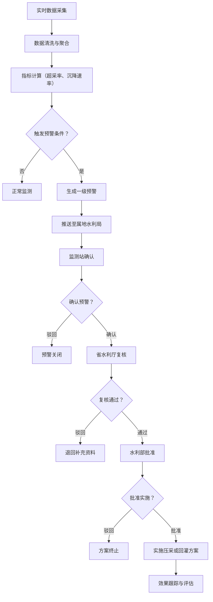
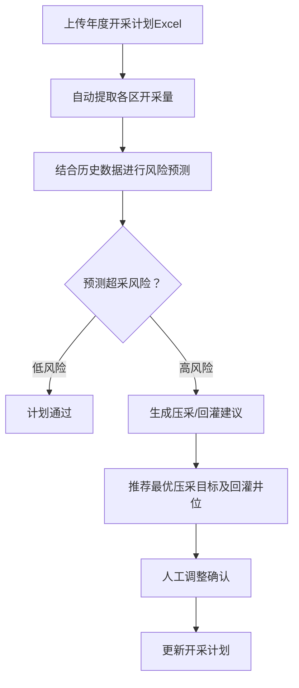

## 1. 产品概述

全国性地下水超采与地面沉降智能监测分析平台，实时接入全国各监测井水位、水文地质参数、GNSS地面沉降点及InSAR遥感数据，通过智能算法实现数据清洗、聚合分析、风险预警、开采优化，为国家、省、市三级水利部门提供科学决策支撑。

- 核心目标：实现全国地下水超采与地面沉降的实时监测、智能预警、科学管控
- 目标用户：国家水利部、各省水利厅、各市水利局的水资源管理与监测人员
- 解决问题：地下水超采监测分散、预警不及时、开采管控缺乏数据支撑

## 2. 核心 Features

### 2.1 User Roles

| 角色 | 注册方式 | 核心权限 |
|------|----------|----------|
| 国家级管理员 | 后台创建 | 查看全国所有监测数据、审批省级压采/回灌方案、生成全国性诊断报告 |
| 省级管理员 | 后台创建 | 查看本省所有监测数据、复核市级压采/回灌方案、审批本省压采/回灌方案、生成本省诊断报告 |
| 市级管理员 | 后台创建 | 查看本市所有监测数据、确认预警信息、提交压采/回灌方案、生成本市诊断报告 |
| 监测站用户 | 后台创建 | 查看所辖监测点数据、确认预警信息、上报监测异常 |

### 2.2 Feature Module

1. **核心看板页面**：全国超采热力图、沉降风险排名、关键指标概览、省份/含水层切换
2. **区域详情页面**：90天水位趋势曲线、沉降漏斗动态演变、开采井分布地图
3. **预警管理页面**：一级预警列表、预警详情、三级审批流程（监测站确认→省厅复核→部批准）
4. **开采计划页面**：年度开采计划Excel上传、开采量自动提取、12个月超采风险预测、最优压采目标推荐、回灌井位推荐
5. **健康诊断报告页面**：周报自动生成、水位同比环比分析、沉降热点地区、开采井合规率、压采方案推荐
6. **权限管理页面**：用户管理、角色管理、权限分配、数据范围控制

### 2.3 Page Details

| 页面名称 | 模块名称 | Feature description |
|----------|----------|---------------------|
| 核心看板 | 顶部导航栏 | 系统名称、用户信息、消息通知、角色切换、退出登录 |
| 核心看板 | 指标概览卡片 | 全国超采率、累计沉降量、平均沉降速率、地下水可开采余量、活跃预警数、监测点在线率 |
| 核心看板 | 超采热力图 | 中国地图热力图，按省份显示超采严重程度，支持下钻到市级 |
| 核心看板 | 沉降风险排名 | 省份/城市沉降风险排行榜，显示沉降速率、累计沉降量、超采率 |
| 核心看板 | 筛选控制区 | 省份选择器、含水层选择器、时间范围选择器 |
| 区域详情 | 区域信息概览 | 区域基本信息、水文地质参数、关键指标 |
| 区域详情 | 水位趋势曲线 | 近90天各监测井水位变化趋势，支持多监测井对比 |
| 区域详情 | 沉降漏斗演变 | 沉降漏斗动态演变动画，支持按时间轴查看 |
| 区域详情 | 开采井分布 | 开采井位置、开采量、合规状态分布地图 |
| 预警管理 | 预警列表 | 按级别、状态、时间筛选的预警列表，显示预警区域、类型、触发条件、当前审批状态 |
| 预警管理 | 预警详情 | 预警触发数据、历史趋势、影响范围、审批流程记录 |
| 预警管理 | 审批流程 | 三级审批操作界面，支持填写审批意见、上传附件 |
| 开采计划 | 计划上传 | Excel文件拖拽上传、模板下载、数据校验、自动提取开采量 |
| 开采计划 | 风险预测 | 未来12个月超采风险预测曲线、红色预警线标记 |
| 开采计划 | 压采推荐 | 最优压采目标区域推荐、压采量计算、回灌井位智能推荐 |
| 健康诊断报告 | 报告列表 | 历史周报列表，支持按时间、区域筛选 |
| 健康诊断报告 | 报告详情 | 水位同比环比图表、沉降热点地区地图、开采井合规率统计、压采方案建议、监督重点 |
| 权限管理 | 用户管理 | 用户列表、新增/编辑/禁用用户、重置密码 |
| 权限管理 | 角色权限 | 角色列表、权限配置、数据范围设置 |

## 3. 核心 Process

### 预警生成与审批流程

### 开采计划审核流程

## 4. User Interface Design

### 4.1 设计风格

- **主色调**：深蓝色系（#1e3a5f, #2563eb, #3b82f6），代表水资源与科技感
- **辅助色**：
  - 预警红色：#dc2626
  - 警告橙色：#f59e0b
  - 正常绿色：#10b981
  - 信息蓝色：#0ea5e9
- **背景色**：深色主题，深灰蓝渐变背景（#0f172a, #1e293b）
- **卡片背景**：半透明白色/深灰色，带毛玻璃效果
- **按钮风格**：圆角矩形，带微悬停动效，主要按钮使用蓝色渐变
- **字体**：
  - 标题：Noto Sans SC Bold，简洁现代的中文字体
  - 正文：Noto Sans SC Regular，确保中文显示清晰
  - 数字：JetBrains Mono，等宽字体用于数据展示
- **布局风格**：卡片式布局，网格化分布，支持响应式
- **图标风格**：线性图标（Lucide Icons），统一线宽2px

### 4.2 页面设计概述

| 页面名称 | 模块名称 | UI Elements |
|----------|----------|-------------|
| 核心看板 | 顶部导航栏 | 深蓝色背景，左侧Logo和系统名称，右侧用户信息和通知，悬浮阴影效果 |
| 核心看板 | 指标概览 | 4个大卡片+2个小卡片横向排列，数据动画加载，悬停缩放效果 |
| 核心看板 | 超采热力图 | 左侧大区域展示交互式中国地图，右侧风险排名列表，地图支持缩放和下钻 |
| 核心看板 | 筛选控制区 | 顶部下拉选择器，蓝色边框，圆角设计，选项带图标 |
| 区域详情 | 水位趋势曲线 | ECharts多折线图，不同监测井不同颜色，支持图例切换，数据点悬浮显示详情 |
| 区域详情 | 沉降漏斗演变 | 等值线热力图，底部时间轴滑块，播放/暂停按钮，动态演变动画 |
| 预警管理 | 预警列表 | 表格+卡片混合布局，预警级别用不同颜色标签标记，审批进度用时间线展示 |
| 预警管理 | 审批流程 | 垂直时间线布局，每个审批节点显示状态、审批人、时间、意见 |
| 开采计划 | 文件上传 | 拖拽上传区域，虚线边框，蓝色主色调，上传进度条动画 |
| 开采计划 | 风险预测 | 面积图，红色虚线标记预警红线，风险区域用红色渐变填充 |
| 健康诊断报告 | 报告详情 | 杂志式布局，分章节展示，图表与文字混排，支持导出PDF |

### 4.3 响应式设计

- **桌面端优先**：针对1920×1080及以上分辨率优化
- **平板适配**：1024-1440px，调整卡片间距，热力图与排名改为上下布局
- **移动适配**：768-1024px，侧边栏收起，卡片纵向堆叠，简化数据展示
- **触控优化**：按钮最小高度44px，支持手势缩放地图

### 4.4 数据可视化指导

- **地图可视化**：使用ECharts Geo组件实现中国地图，热力值映射到颜色渐变（绿色→黄色→红色）
- **趋势图表**：ECharts折线图/面积图，支持数据缩放，动画过渡效果
- **沉降漏斗**：ECharts热力图+等值线，时间轴动画
- **进度展示**：环形进度条、进度条、仪表盘多种形式
- **审批流程**：时间线组件，不同状态不同颜色
