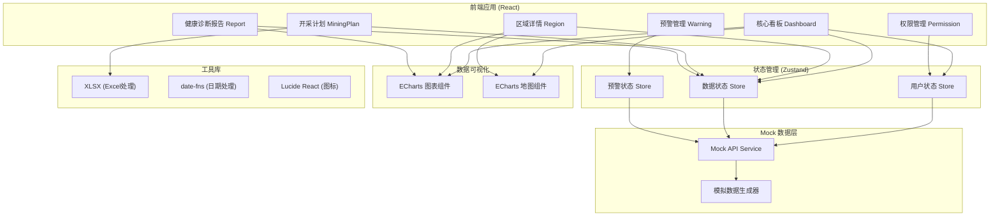
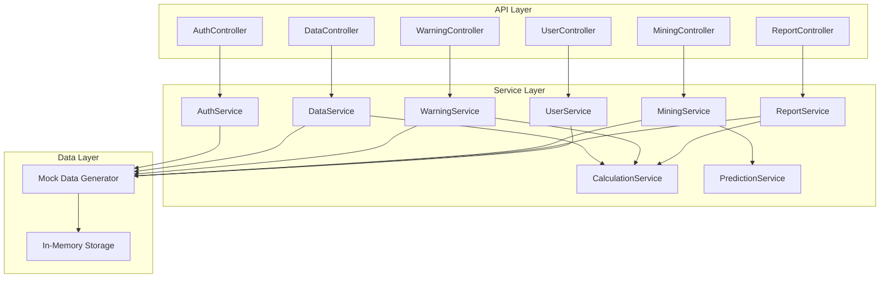

## 1. Architecture Design



## 2. Technology Description

### 2.1 前端技术栈
- **框架**: React@18.2.0 + TypeScript@5.3.0
- **构建工具**: Vite@5.0.0
- **样式方案**: TailwindCSS@3.4.0
- **路由**: React Router DOM@6.20.0
- **状态管理**: Zustand@4.4.0
- **UI组件**: 自定义组件库 + Headless UI@1.7.0
- **数据可视化**: ECharts@5.4.3 + echarts-for-react@3.0.2
- **图标**: Lucide React@0.294.0
- **Excel处理**: SheetJS (xlsx)@0.18.5
- **日期处理**: date-fns@2.30.0
- **HTTP客户端**: Axios@1.6.0 (用于mock数据请求)

### 2.2 项目结构
```
src/
├── assets/              # 静态资源
│   ├── fonts/           # 字体文件
│   ├── geo/             # 地图GeoJSON数据
│   └── images/          # 图片资源
├── components/          # 通用组件
│   ├── ui/              # 基础UI组件
│   ├── charts/          # 图表组件
│   ├── layout/          # 布局组件
│   └── common/          # 公共业务组件
├── pages/               # 页面组件
│   ├── Dashboard/       # 核心看板
│   ├── Region/          # 区域详情
│   ├── Warning/         # 预警管理
│   ├── MiningPlan/      # 开采计划
│   ├── Report/          # 健康诊断报告
│   └── Permission/      # 权限管理
├── store/               # 状态管理
│   ├── useUserStore.ts
│   ├── useDataStore.ts
│   └── useWarningStore.ts
├── services/            # API服务
│   ├── mock/            # Mock数据
│   ├── user.ts
│   ├── data.ts
│   ├── warning.ts
│   └── mining.ts
├── types/               # TypeScript类型定义
│   ├── index.ts
│   ├── data.ts
│   ├── warning.ts
│   └── user.ts
├── utils/               # 工具函数
│   ├── excel.ts
│   ├── date.ts
│   ├── calculation.ts
│   └── permission.ts
├── hooks/               # 自定义Hooks
│   ├── usePermission.ts
│   ├── useChart.ts
│   └── useMap.ts
├── App.tsx
├── main.tsx
└── index.css
```

## 3. Route Definitions

| Route | Page Name | Purpose |
|-------|-----------|---------|
| `/` | 登录页 | 用户登录、角色选择 |
| `/dashboard` | 核心看板 | 全国超采热力图、沉降风险排名、关键指标概览 |
| `/region/:provinceId?/:cityId?` | 区域详情 | 水位趋势、沉降漏斗、开采井分布 |
| `/warning` | 预警管理 | 预警列表、预警详情、三级审批流程 |
| `/warning/:id` | 预警详情 | 单个预警的详细信息和审批操作 |
| `/mining-plan` | 开采计划 | Excel上传、风险预测、压采推荐 |
| `/report` | 健康诊断报告 | 周报列表、报告详情、导出PDF |
| `/report/:id` | 报告详情 | 单份报告的详细内容 |
| `/permission` | 权限管理 | 用户管理、角色管理、权限配置 |
| `*` | 404页面 | 路由未找到 |

## 4. API Definitions (Mock)

### 4.1 TypeScript 类型定义

```typescript
// 基础类型
interface BaseEntity {
  id: string;
  createdAt: string;
  updatedAt: string;
}

// 用户相关
type UserRole = 'national' | 'provincial' | 'municipal' | 'station';

interface User extends BaseEntity {
  username: string;
  name: string;
  role: UserRole;
  provinceId?: string;
  cityId?: string;
  stationId?: string;
  email: string;
  phone: string;
  status: 'active' | 'disabled';
}

interface LoginRequest {
  username: string;
  password: string;
}

interface LoginResponse {
  token: string;
  user: User;
  permissions: string[];
}

// 区域相关
interface Province {
  id: string;
  name: string;
  code: string;
  geometry: GeoJSON.Polygon;
}

interface City {
  id: string;
  provinceId: string;
  name: string;
  code: string;
  geometry: GeoJSON.Polygon;
}

// 监测数据相关
interface MonitoringWell extends BaseEntity {
  wellNo: string;
  name: string;
  provinceId: string;
  cityId: string;
  aquifer: string;
  longitude: number;
  latitude: number;
  depth: number;
  status: 'online' | 'offline' | 'maintenance';
}

interface WaterLevelData {
  wellId: string;
  timestamp: string;
  waterLevel: number;
  temperature: number;
  conductivity: number;
}

interface HydrogeologyParams {
  regionId: string;
  aquifer: string;
  permeabilityCoefficient: number;
  storageCoefficient: number;
  transmissivity: number;
  specificYield: number;
}

interface GNSSPoint extends BaseEntity {
  pointNo: string;
  name: string;
  provinceId: string;
  cityId: string;
  longitude: number;
  latitude: number;
  elevation: number;
}

interface SubsidenceData {
  pointId: string;
  timestamp: string;
  cumulativeSubsidence: number;
  subsidenceRate: number;
}

interface InSARData {
  regionId: string;
  timestamp: string;
  subsidenceMap: GeoJSON.Raster;
  averageRate: number;
  maxRate: number;
}

// 指标计算结果
interface RegionIndicators {
  regionId: string;
  regionType: 'province' | 'city';
  timeRange: string;
  overexploitationRate: number;
  cumulativeSubsidence: number;
  subsidenceRate: number;
  allowableExtraction: number;
  actualExtraction: number;
  remainingAllowable: number;
  waterLevelDepth: number;
  historicalMeanDepth: number;
  depthAnomaly: number;
}

// 预警相关
type WarningType = 'water_level' | 'subsidence';
type WarningLevel = 'primary' | 'secondary' | 'tertiary';
type WarningStatus = 'pending_confirm' | 'confirmed' | 'reviewing' | 'approved' | 'rejected' | 'closed';

interface Warning extends BaseEntity {
  warningNo: string;
  type: WarningType;
  level: WarningLevel;
  regionId: string;
  regionName: string;
  triggerCondition: string;
  triggerValue: number;
  threshold: number;
  continuousMonths: number;
  status: WarningStatus;
  affectedArea: number;
  affectedPopulation: number;
  description: string;
  approvalProcess: ApprovalStep[];
}

interface ApprovalStep {
  id: string;
  stepOrder: number;
  stepName: string;
  role: UserRole;
  status: 'pending' | 'approved' | 'rejected';
  approverId?: string;
  approverName?: string;
  approvedAt?: string;
  opinion: string;
  attachments: string[];
}

// 开采计划相关
interface MiningPlan extends BaseEntity {
  planNo: string;
  year: number;
  provinceId: string;
  totalExtraction: number;
  regionalPlans: RegionalMiningPlan[];
  status: 'draft' | 'submitted' | 'approved' | 'rejected';
  riskPrediction: RiskPrediction[];
  optimizationSuggestion: OptimizationSuggestion;
}

interface RegionalMiningPlan {
  regionId: string;
  regionName: string;
  plannedExtraction: number;
  allowableExtraction: number;
  predictedRisk: 'low' | 'medium' | 'high';
}

interface RiskPrediction {
  month: string;
  predictedExtraction: number;
  allowableExtraction: number;
  riskLevel: 'low' | 'medium' | 'high';
  overexploitationAmount: number;
}

interface OptimizationSuggestion {
  targetRegions: TargetRegion[];
  rechargeWells: RechargeWell[];
  totalReductionTarget: number;
  estimatedEffect: string;
}

interface TargetRegion {
  regionId: string;
  regionName: string;
  currentExtraction: number;
  suggestedReduction: number;
  reason: string;
}

interface RechargeWell {
  wellNo: string;
  name: string;
  longitude: number;
  latitude: number;
  suggestedRechargeAmount: number;
  aquifer: string;
  priority: number;
}

// 健康诊断报告相关
interface HealthReport extends BaseEntity {
  reportNo: string;
  reportType: 'weekly' | 'monthly' | 'quarterly';
  periodStart: string;
  periodEnd: string;
  regionId: string;
  regionName: string;
  waterLevelAnalysis: WaterLevelAnalysis;
  subsidenceAnalysis: SubsidenceAnalysis;
  complianceAnalysis: ComplianceAnalysis;
  recommendations: Recommendation[];
  supervisionPriorities: SupervisionPriority[];
}

interface WaterLevelAnalysis {
  averageLevel: number;
  yoyChange: number;
  momChange: number;
  regionalDistribution: RegionalLevel[];
}

interface RegionalLevel {
  regionId: string;
  regionName: string;
  averageLevel: number;
  yoyChange: number;
  momChange: number;
}

interface SubsidenceAnalysis {
  hotspotRegions: HotspotRegion[];
  averageRate: number;
  maxRate: number;
  cumulativeSubsidence: number;
}

interface HotspotRegion {
  regionId: string;
  regionName: string;
  subsidenceRate: number;
  cumulativeSubsidence: number;
  riskLevel: 'high' | 'medium' | 'low';
}

interface ComplianceAnalysis {
  totalWells: number;
  compliantWells: number;
  complianceRate: number;
  nonCompliantWells: NonCompliantWell[];
}

interface NonCompliantWell {
  wellId: string;
  wellName: string;
  regionName: string;
  issue: string;
  overExtractionAmount: number;
}

interface Recommendation {
  id: string;
  type: 'extraction_control' | 'recharge' | 'monitoring' | 'management';
  title: string;
  content: string;
  priority: 'high' | 'medium' | 'low';
}

interface SupervisionPriority {
  id: string;
  regionId: string;
  regionName: string;
  focus: string;
  reason: string;
}
```

### 4.2 API Endpoints

```typescript
// 用户相关
POST /api/auth/login -> LoginResponse
GET /api/auth/logout -> void
GET /api/users -> User[]
POST /api/users -> User
PUT /api/users/:id -> User
DELETE /api/users/:id -> void

// 区域数据
GET /api/provinces -> Province[]
GET /api/provinces/:id/cities -> City[]

// 监测数据
GET /api/monitoring-wells -> MonitoringWell[]
GET /api/monitoring-wells/:id/water-level?startDate=&endDate= -> WaterLevelData[]
GET /api/gnss-points -> GNSSPoint[]
GET /api/gnss-points/:id/subsidence?startDate=&endDate= -> SubsidenceData[]
GET /api/insar-data?regionId=&date= -> InSARData
GET /api/hydrogeology-params?regionId=&aquifer= -> HydrogeologyParams

// 指标计算
GET /api/indicators/region?regionId=&timeRange=&aquifer= -> RegionIndicators
GET /api/indicators/national?timeRange=&aquifer= -> RegionIndicators[]

// 预警相关
GET /api/warnings?status=&type=&regionId=&page=&pageSize= -> { data: Warning[], total: number }
GET /api/warnings/:id -> Warning
POST /api/warnings/:id/confirm -> Warning
POST /api/warnings/:id/review -> Warning
POST /api/warnings/:id/approve -> Warning
POST /api/warnings/:id/reject -> Warning
POST /api/warnings/:id/close -> Warning

// 开采计划相关
POST /api/mining-plan/upload -> { plan: MiningPlan, extractedData: any[] }
GET /api/mining-plan?year=&regionId= -> MiningPlan[]
GET /api/mining-plan/:id -> MiningPlan
POST /api/mining-plan/:id/submit -> MiningPlan
POST /api/mining-plan/:id/approve -> MiningPlan
GET /api/mining-plan/template -> File

// 健康诊断报告
GET /api/reports?type=&regionId=&startDate=&endDate= -> HealthReport[]
GET /api/reports/:id -> HealthReport
POST /api/reports/generate -> HealthReport
GET /api/reports/:id/export -> File
```

## 5. Server Architecture Diagram (Mock)



## 6. Data Model

### 6.1 Data Model Definition (ER Diagram)

```mermaid
erDiagram
    USER ||--o{ WARNING : "approves"
    USER ||--o{ MINING_PLAN : "creates"
    USER ||--o{ HEALTH_REPORT : "generates"
    PROVINCE ||--o{ CITY : "contains"
    PROVINCE ||--o{ MONITORING_WELL : "has"
    CITY ||--o{ MONITORING_WELL : "has"
    MONITORING_WELL ||--o{ WATER_LEVEL_DATA : "produces"
    PROVINCE ||--o{ GNSS_POINT : "has"
    CITY ||--o{ GNSS_POINT : "has"
    GNSS_POINT ||--o{ SUBSIDENCE_DATA : "produces"
    PROVINCE ||--o{ INSAR_DATA : "has"
    CITY ||--o{ INSAR_DATA : "has"
    REGION ||--o{ HYDROGEOLOGY_PARAMS : "has"
    REGION ||--o{ REGION_INDICATORS : "calculates"
    REGION ||--o{ WARNING : "triggers"
    WARNING ||--|{ APPROVAL_STEP : "has"
    MINING_PLAN ||--|{ REGIONAL_MINING_PLAN : "contains"
    MINING_PLAN ||--|{ RISK_PREDICTION : "has"
    MINING_PLAN ||--|| OPTIMIZATION_SUGGESTION : "has"
    OPTIMIZATION_SUGGESTION ||--|{ TARGET_REGION : "contains"
    OPTIMIZATION_SUGGESTION ||--|{ RECHARGE_WELL : "contains"
    HEALTH_REPORT ||--|| WATER_LEVEL_ANALYSIS : "contains"
    HEALTH_REPORT ||--|| SUBSIDENCE_ANALYSIS : "contains"
    HEALTH_REPORT ||--|| COMPLIANCE_ANALYSIS : "contains"
    HEALTH_REPORT ||--|{ RECOMMENDATION : "has"
    HEALTH_REPORT ||--|{ SUPERVISION_PRIORITY : "has"
    
    USER {
        string id PK
        string username
        string name
        string role
        string provinceId FK
        string cityId FK
        string email
        string phone
        string status
    }
    
    PROVINCE {
        string id PK
        string name
        string code
        json geometry
    }
    
    CITY {
        string id PK
        string provinceId FK
        string name
        string code
        json geometry
    }
    
    MONITORING_WELL {
        string id PK
        string wellNo
        string name
        string provinceId FK
        string cityId FK
        string aquifer
        decimal longitude
        decimal latitude
        decimal depth
        string status
    }
    
    WATER_LEVEL_DATA {
        string id PK
        string wellId FK
        datetime timestamp
        decimal waterLevel
        decimal temperature
        decimal conductivity
    }
    
    GNSS_POINT {
        string id PK
        string pointNo
        string name
        string provinceId FK
        string cityId FK
        decimal longitude
        decimal latitude
        decimal elevation
    }
    
    SUBSIDENCE_DATA {
        string id PK
        string pointId FK
        datetime timestamp
        decimal cumulativeSubsidence
        decimal subsidenceRate
    }
    
    INSAR_DATA {
        string id PK
        string regionId FK
        date timestamp
        raster subsidenceMap
        decimal averageRate
        decimal maxRate
    }
    
    HYDROGEOLOGY_PARAMS {
        string id PK
        string regionId FK
        string aquifer
        decimal permeabilityCoefficient
        decimal storageCoefficient
        decimal transmissivity
        decimal specificYield
    }
    
    REGION_INDICATORS {
        string id PK
        string regionId FK
        string regionType
        string timeRange
        decimal overexploitationRate
        decimal cumulativeSubsidence
        decimal subsidenceRate
        decimal allowableExtraction
        decimal actualExtraction
        decimal remainingAllowable
        decimal waterLevelDepth
        decimal historicalMeanDepth
        decimal depthAnomaly
    }
    
    WARNING {
        string id PK
        string warningNo
        string type
        string level
        string regionId FK
        string regionName
        string triggerCondition
        decimal triggerValue
        decimal threshold
        int continuousMonths
        string status
        decimal affectedArea
        int affectedPopulation
        text description
    }
    
    APPROVAL_STEP {
        string id PK
        string warningId FK
        int stepOrder
        string stepName
        string role
        string status
        string approverId FK
        datetime approvedAt
        text opinion
        json attachments
    }
    
    MINING_PLAN {
        string id PK
        string planNo
        int year
        string provinceId FK
        decimal totalExtraction
        string status
        string createdBy FK
    }
    
    REGIONAL_MINING_PLAN {
        string id PK
        string planId FK
        string regionId FK
        decimal plannedExtraction
        decimal allowableExtraction
        string predictedRisk
    }
    
    RISK_PREDICTION {
        string id PK
        string planId FK
        date month
        decimal predictedExtraction
        decimal allowableExtraction
        string riskLevel
        decimal overexploitationAmount
    }
    
    OPTIMIZATION_SUGGESTION {
        string id PK
        string planId FK
        decimal totalReductionTarget
        text estimatedEffect
    }
    
    TARGET_REGION {
        string id PK
        string suggestionId FK
        string regionId FK
        decimal currentExtraction
        decimal suggestedReduction
        text reason
    }
    
    RECHARGE_WELL {
        string id PK
        string suggestionId FK
        string wellNo
        string name
        decimal longitude
        decimal latitude
        decimal suggestedRechargeAmount
        string aquifer
        int priority
    }
    
    HEALTH_REPORT {
        string id PK
        string reportNo
        string reportType
        date periodStart
        date periodEnd
        string regionId FK
        string generatedBy FK
    }
    
    WATER_LEVEL_ANALYSIS {
        string id PK
        string reportId FK
        decimal averageLevel
        decimal yoyChange
        decimal momChange
    }
    
    SUBSIDENCE_ANALYSIS {
        string id PK
        string reportId FK
        decimal averageRate
        decimal maxRate
        decimal cumulativeSubsidence
    }
    
    COMPLIANCE_ANALYSIS {
        string id PK
        string reportId FK
        int totalWells
        int compliantWells
        decimal complianceRate
    }
    
    RECOMMENDATION {
        string id PK
        string reportId FK
        string type
        string title
        text content
        string priority
    }
    
    SUPERVISION_PRIORITY {
        string id PK
        string reportId FK
        string regionId FK
        string focus
        text reason
    }
```



### 6.2 Mock Data Generation Strategy

1. **地理数据**：使用真实的中国省级行政区划GeoJSON数据
2. **监测井数据**：每个省份生成10-20个监测井，分布均匀
3. **水位数据**：生成过去365天的每小时水位数据，模拟季节性变化和下降趋势
4. **GNSS沉降数据**：每个省份生成5-10个GNSS监测点，沉降速率0-5cm/年
5. **InSAR数据**：每月生成一次省级沉降热力图数据
6. **水文地质参数**：根据不同含水层生成合理的参数范围
7. **预警数据**：模拟3-5个活跃预警，包含不同审批阶段
8. **开采计划**：生成年度开采计划，包含风险预测和优化建议
9. **健康诊断报告**：生成最近12周的周报数据
